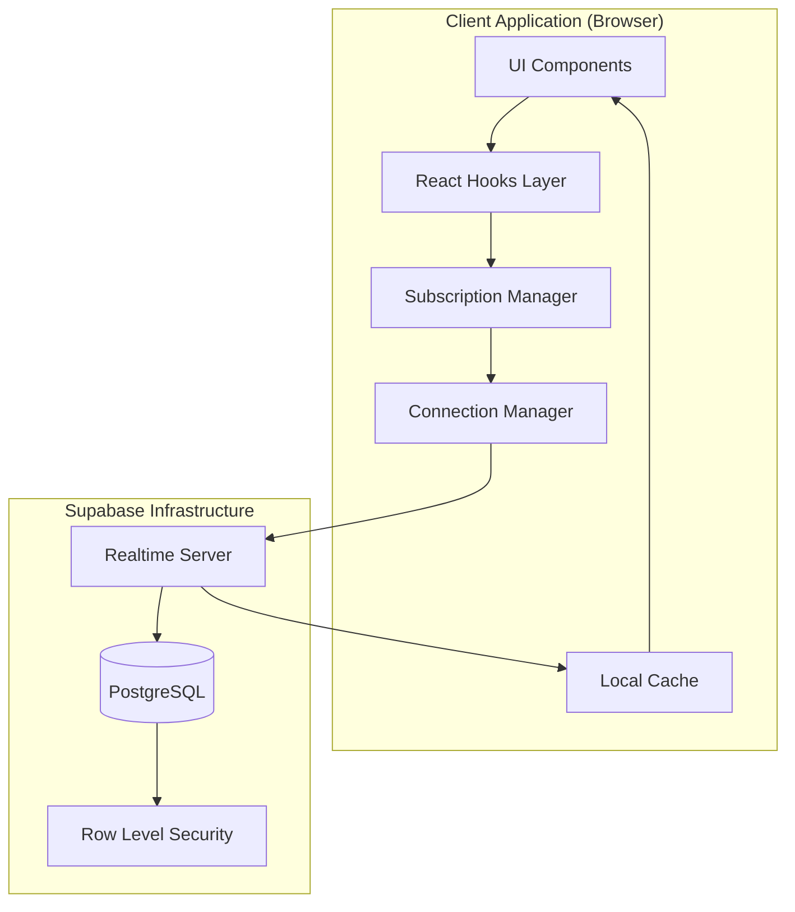

# Design Document: Real-Time Data Synchronization

## Overview

This design document specifies the architecture and implementation approach for real-time data synchronization across the RUHIZ application. The system will leverage Supabase Realtime to provide instant updates for messaging, join requests, project updates, member changes, and notifications across all application tabs (Projects, Study Groups, and Dashboard) without requiring manual page refreshes.

### Goals

- Provide sub-500ms latency for real-time updates across all application features
- Ensure data consistency across multiple concurrent users and browser tabs
- Minimize resource usage through efficient subscription management
- Handle connection failures gracefully with automatic reconnection
- Maintain security through proper authorization and RLS policies
- Support 100+ concurrent users per project/study group

### Non-Goals

- Offline-first architecture with full local database replication
- Peer-to-peer synchronization without server coordination
- Real-time collaborative editing with operational transformation
- Video/audio streaming infrastructure

## Architecture

### High-Level Architecture

The real-time synchronization system follows a hub-and-spoke architecture where Supabase Realtime acts as the central hub, and client applications subscribe to specific data channels based on their current view and user permissions.



### Data Flow

1. **Subscription Initialization**: When a component mounts, it requests a subscription through a React hook
2. **Channel Creation**: The Subscription Manager creates or reuses a WebSocket channel to Supabase Realtime
3. **Authorization**: Supabase validates the user's session token and applies RLS policies
4. **Change Detection**: PostgreSQL triggers notify Realtime of INSERT/UPDATE/DELETE operations
5. **Event Broadcasting**: Realtime broadcasts change events to all authorized subscribers
6. **UI Update**: React hooks receive events, update local cache, and trigger component re-renders

### Key Design Decisions

**Decision 1: Centralized Subscription Manager**
- **Rationale**: Prevents duplicate subscriptions, enables channel reuse, and provides a single point for connection state management
- **Trade-off**: Adds complexity but significantly reduces resource usage

**Decision 2: Optimistic Updates with Rollback**
- **Rationale**: Provides instant user feedback while maintaining data consistency
- **Trade-off**: Requires careful conflict resolution but greatly improves perceived performance

**Decision 3: Table-Level Subscriptions**
- **Rationale**: Supabase Realtime works at the table level; filtering happens client-side
- **Trade-off**: May receive more events than needed, but simplifies subscription logic

**Decision 4: Custom React Hooks for Each Feature**
- **Rationale**: Encapsulates subscription logic, provides clean API, enables code reuse
- **Trade-off**: More hooks to maintain, but better separation of concerns

## Components and Interfaces

### 1. Connection Manager

**Responsibility**: Manages the WebSocket connection lifecycle, authentication, and reconnection logic.

**Interface**:
```typescript
interface ConnectionManager {
  // Connection state
  getConnectionState(): ConnectionState;
  onStateChange(callback: (state: ConnectionState) => void): Unsubscribe;
  
  // Connection control
  connect(): Promise<void>;
  disconnect(): void;
  reconnect(): Promise<void>;
  
  // Authentication
  setAuth(token: string): void;
  clearAuth(): void;
}

type ConnectionState = 
  | { status: 'connected'; connectedAt: Date }
  | { status: 'disconnected'; reason?: string }
  | { status: 'reconnecting'; attempt: number; nextRetryIn: number }
  | { status: 'error'; error: Error };

type Unsubscribe = () => void;
```

**Key Behaviors**:
- Automatically reconnects with exponential backoff (1s, 2s, 4s, 8s, 16s max)
- Refreshes auth token before expiration
- Emits connection state changes to subscribers
- Queues operations during disconnection

### 2. Subscription Manager

**Responsibility**: Creates, manages, and cleans up Realtime subscriptions with channel reuse.

**Interface**:
```typescript
interface SubscriptionManager {
  // Subscription lifecycle
  subscribe<T>(config: SubscriptionConfig<T>): Subscription<T>;
  unsubscribe(subscriptionId: string): void;
  unsubscribeAll(): void;
  
  // Channel management
  getActiveChannels(): ChannelInfo[];
  getSubscriptionCount(): number;
}

interface SubscriptionConfig<T> {
  table: string;
  filter?: RealtimeFilter;
  event?: 'INSERT' | 'UPDATE' | 'DELETE' | '*';
  onInsert?: (record: T) => void;
  onUpdate?: (record: T, old: T) => void;
  onDelete?: (record: T) => void;
  onError?: (error: Error) => void;
}

interface Subscription<T> {
  id: string;
  unsubscribe: () => void;
  getStatus(): 'active' | 'inactive' | 'error';
}

interface RealtimeFilter {
  column: string;
  operator: 'eq' | 'neq' | 'gt' | 'gte' | 'lt' | 'lte' | 'in';
  value: any;
}
```

**Key Behaviors**:
- Reuses channels when multiple components subscribe to the same table
- Automatically unsubscribes when all components using a channel unmount
- Batches events within 100ms to prevent excessive re-renders
- Applies client-side filtering for row-level subscriptions

### 3. React Hooks Layer

**Responsibility**: Provides feature-specific hooks that encapsulate subscription logic and state management.

#### useRealtimeMessages

```typescript
interface UseRealtimeMessagesConfig {
  projectId?: string;
  studyGroupId?: string;
  enabled?: boolean;
}

interface UseRealtimeMessagesReturn {
  messages: Message[];
  loading: boolean;
  error: Error | null;
  sendMessage: (content: string) => Promise<void>;
  deleteMessage: (messageId: string) => Promise<void>;
  editMessage: (messageId: string, content: string) => Promise<void>;
}

function useRealtimeMessages(
  config: UseRealtimeMessagesConfig
): UseRealtimeMessagesReturn;
```

#### useRealtimeJoinRequests

```typescript
interface UseRealtimeJoinRequestsConfig {
  projectId?: string;
  studyGroupId?: string;
  enabled?: boolean;
}

interface UseRealtimeJoinRequestsReturn {
  joinRequests: JoinRequest[];
  loading: boolean;
  error: Error | null;
  approveRequest: (requestId: string) => Promise<void>;
  rejectRequest: (requestId: string) => Promise<void>;
}

function useRealtimeJoinRequests(
  config: UseRealtimeJoinRequestsConfig
): UseRealtimeJoinRequestsReturn;
```

#### useRealtimeMembers

```typescript
interface UseRealtimeMembersConfig {
  projectId?: string;
  studyGroupId?: string;
  enabled?: boolean;
}

interface UseRealtimeMembersReturn {
  members: Member[];
  loading: boolean;
  error: Error | null;
  onlineMembers: Set<string>;
  removeMember: (memberId: string) => Promise<void>;
  updateMemberRole: (memberId: string, role: MemberRole) => Promise<void>;
}

function useRealtimeMembers(
  config: UseRealtimeMembersConfig
): UseRealtimeMembersReturn;
```

#### useRealtimeProject

```typescript
interface UseRealtimeProjectConfig {
  projectId: string;
  enabled?: boolean;
}

interface UseRealtimeProjectReturn {
  project: Project | null;
  loading: boolean;
  error: Error | null;
  updateProject: (updates: Partial<Project>) => Promise<void>;
}

function useRealtimeProject(
  config: UseRealtimeProjectConfig
): UseRealtimeProjectReturn;
```

#### useRealtimeNotifications

```typescript
interface UseRealtimeNotificationsConfig {
  userId: string;
  enabled?: boolean;
}

interface UseRealtimeNotificationsReturn {
  notifications: Notification[];
  unreadCount: number;
  loading: boolean;
  error: Error | null;
  markAsRead: (notificationId: string) => Promise<void>;
  markAllAsRead: () => Promise<void>;
  deleteNotification: (notificationId: string) => Promise<void>;
}

function useRealtimeNotifications(
  config: UseRealtimeNotificationsConfig
): UseRealtimeNotificationsReturn;
```

#### useRealtimeDashboard

```typescript
interface UseRealtimeDashboardConfig {
  userId: string;
  enabled?: boolean;
}

interface UseRealtimeDashboardReturn {
  projects: Project[];
  studyGroups: StudyGroup[];
  recentActivity: Activity[];
  unreadCounts: Map<string, number>;
  loading: boolean;
  error: Error | null;
}

function useRealtimeDashboard(
  config: UseRealtimeDashboardConfig
): UseRealtimeDashboardReturn;
```

#### useConnectionState

```typescript
interface UseConnectionStateReturn {
  state: ConnectionState;
  isConnected: boolean;
  isReconnecting: boolean;
  reconnect: () => Promise<void>;
}

function useConnectionState(): UseConnectionStateReturn;
```

### 4. Local Cache

**Responsibility**: Stores recent data locally to enable instant UI updates and offline resilience.

**Interface**:
```typescript
interface LocalCache {
  // Read operations
  get<T>(key: string): T | null;
  getMany<T>(keys: string[]): Map<string, T>;
  
  // Write operations
  set<T>(key: string, value: T, ttl?: number): void;
  setMany<T>(entries: Map<string, T>, ttl?: number): void;
  
  // Delete operations
  delete(key: string): void;
  deleteMany(keys: string[]): void;
  clear(): void;
  
  // Cache management
  invalidate(pattern: string): void;
  getSize(): number;
}
```

**Key Behaviors**:
- Uses LRU eviction when cache exceeds size limit (10MB default)
- Supports TTL-based expiration
- Provides pattern-based invalidation for related data
- Persists to IndexedDB for cross-tab synchronization

### 5. Optimistic Update Manager

**Responsibility**: Applies optimistic updates and handles rollback on failure.

**Interface**:
```typescript
interface OptimisticUpdateManager {
  // Apply optimistic update
  apply<T>(
    operation: OptimisticOperation<T>
  ): Promise<T>;
  
  // Rollback on failure
  rollback(operationId: string): void;
  
  // Get pending operations
  getPending(): OptimisticOperation<any>[];
}

interface OptimisticOperation<T> {
  id: string;
  type: 'insert' | 'update' | 'delete';
  table: string;
  data: T;
  optimisticData: T;
  serverOperation: () => Promise<T>;
  onSuccess?: (result: T) => void;
  onError?: (error: Error) => void;
}
```

**Key Behaviors**:
- Applies optimistic update to local cache immediately
- Executes server operation in background
- On success: confirms optimistic update
- On failure: rolls back optimistic update and shows error
- Queues operations during disconnection

## Data Models

### Message

```typescript
interface Message {
  id: string;
  content: string;
  sender_id: string;
  project_id: string | null;
  study_group_id: string | null;
  created_at: Date;
  updated_at?: Date;
  deleted_at?: Date;
  
  // Populated fields
  sender?: User;
  reactions?: MessageReaction[];
  
  // Optimistic update tracking
  _optimistic?: boolean;
  _pending?: boolean;
}
```

### JoinRequest

```typescript
interface JoinRequest {
  id: string;
  project_id: string | null;
  study_group_id: string | null;
  user_id: string;
  message: string | null;
  status: 'PENDING' | 'ACCEPTED' | 'REJECTED';
  created_at: Date;
  
  // Populated fields
  user?: User;
  project?: Project;
  studyGroup?: StudyGroup;
}
```

### Member

```typescript
interface Member {
  id: string;
  project_id: string | null;
  study_group_id: string | null;
  user_id: string;
  role: 'ADMIN' | 'MEMBER' | 'LEADER';
  joined_at: Date;
  
  // Populated fields
  user?: User;
  
  // Real-time status
  online?: boolean;
  lastSeen?: Date;
}
```

### Project

```typescript
interface Project {
  id: string;
  title: string;
  problem: string;
  description: string;
  status: 'OPEN' | 'IN_PROGRESS' | 'COMPLETED';
  timeline: string | null;
  max_members: number;
  owner_id: string;
  created_at: Date;
  updated_at: Date;
  
  // Populated fields
  owner?: User;
  members?: Member[];
  skills?: string[];
  
  // Real-time metadata
  unreadCount?: number;
  lastActivity?: Date;
}
```

### Notification

```typescript
interface Notification {
  id: string;
  user_id: string;
  type: 'MESSAGE' | 'JOIN_REQUEST' | 'MEMBER_ADDED' | 'ROLE_CHANGED' | 'PROJECT_UPDATE';
  title: string;
  message: string;
  read: boolean;
  created_at: Date;
  
  // Metadata
  metadata?: {
    projectId?: string;
    studyGroupId?: string;
    messageId?: string;
    requestId?: string;
  };
}
```

### RealtimeEvent

```typescript
interface RealtimeEvent<T> {
  eventType: 'INSERT' | 'UPDATE' | 'DELETE';
  table: string;
  schema: string;
  new: T | null;
  old: T | null;
  timestamp: Date;
  commitTimestamp: string;
}
```

## Error Handling

### Error Types

```typescript
type RealtimeError =
  | { type: 'CONNECTION_FAILED'; message: string; retryable: boolean }
  | { type: 'SUBSCRIPTION_FAILED'; table: string; reason: string }
  | { type: 'AUTH_EXPIRED'; message: string }
  | { type: 'PERMISSION_DENIED'; table: string; operation: string }
  | { type: 'OPTIMISTIC_UPDATE_FAILED'; operation: string; error: Error }
  | { type: 'SYNC_CONFLICT'; table: string; recordId: string }
  | { type: 'RATE_LIMIT_EXCEEDED'; retryAfter: number };
```

### Error Handling Strategy

**Connection Errors**:
- Automatically retry with exponential backoff
- Display connection status indicator to user
- Queue operations for retry when reconnected
- After 3 failed attempts, show manual reconnect option

**Subscription Errors**:
- Log error details for debugging
- Attempt to resubscribe once
- If resubscription fails, fall back to polling
- Notify user if critical subscriptions fail

**Authentication Errors**:
- Refresh auth token automatically
- If refresh fails, redirect to login
- Clear all subscriptions on auth failure

**Permission Errors**:
- Silently ignore events for unauthorized data
- Log permission denials for security monitoring
- Unsubscribe from channels user no longer has access to

**Optimistic Update Failures**:
- Rollback optimistic update immediately
- Show error toast to user
- Provide retry option for failed operations
- Refresh data from server to ensure consistency

**Sync Conflicts**:
- Server state always wins
- Notify user if their pending changes conflict
- Provide option to reapply changes on top of server state

## Testing Strategy

### Overview

This feature involves real-time infrastructure, WebSocket communication, and integration with Supabase Realtime. **Property-based testing is not appropriate** for this feature because:

1. **Infrastructure Focus**: The system primarily manages WebSocket connections and subscriptions, which are stateful infrastructure components
2. **External Service Integration**: Most behavior depends on Supabase Realtime's event propagation, not our code's logic
3. **UI and State Management**: React hooks and UI updates are better tested with example-based tests
4. **Integration Nature**: The core value is in how components integrate, not in universal properties of pure functions

**Testing Approach**: We will use a combination of unit tests (with mocks), integration tests (with real or mocked Supabase), and performance tests to ensure correctness and reliability.

### Unit Tests

Unit tests will verify individual components in isolation using mocks for external dependencies.

**Connection Manager Tests**:
- Test connection lifecycle (connect, disconnect, reconnect)
- Verify exponential backoff timing (1s, 2s, 4s, 8s, 16s)
- Test auth token refresh before expiration
- Verify state change notifications are emitted
- Test manual reconnect after max retry attempts
- Verify connection state transitions

**Subscription Manager Tests**:
- Test channel creation for new subscriptions
- Verify channel reuse when multiple components subscribe to same table
- Test subscription cleanup when all components unmount
- Verify event batching within 100ms window
- Test client-side filtering of events
- Verify subscription count tracking

**Optimistic Update Manager Tests**:
- Test optimistic update application to local cache
- Verify rollback on server operation failure
- Test operation queuing during disconnection
- Verify conflict resolution (server state wins)
- Test success and error callbacks
- Verify pending operation tracking

**React Hooks Tests** (using React Testing Library):
- Test hook initialization and cleanup
- Verify data fetching on mount
- Test optimistic updates for mutations
- Verify error handling and error states
- Test loading states
- Verify subscription cleanup on unmount
- Test conditional subscription (enabled flag)

**Local Cache Tests**:
- Test LRU eviction when size limit exceeded
- Verify TTL-based expiration
- Test pattern-based invalidation
- Verify IndexedDB persistence
- Test cache hit/miss tracking

### Integration Tests

Integration tests will verify end-to-end flows with real or mocked Supabase Realtime.

**End-to-End Message Flow**:
1. User A sends message via `sendMessage()`
2. Verify optimistic update appears immediately in User A's UI
3. Verify message is sent to Supabase
4. Simulate Realtime event broadcast
5. Verify message appears in User B's UI within 500ms
6. Verify message persisted to database

**Join Request Flow**:
1. User submits join request
2. Verify request appears in requester's UI (optimistic)
3. Simulate Realtime event to owner
4. Verify owner receives notification within 500ms
5. Owner approves request
6. Simulate Realtime event to requester
7. Verify requester sees approval within 500ms
8. Verify member list updates for all viewers

**Connection Resilience**:
1. Establish WebSocket connection
2. Simulate network disconnection
3. Verify connection state changes to 'disconnected'
4. Verify reconnection attempts with exponential backoff
5. Simulate successful reconnection
6. Verify missed updates are fetched from database
7. Verify queued operations are retried

**Multi-Tab Synchronization**:
1. Open application in two browser tabs
2. Perform action in Tab 1 (send message)
3. Verify update appears in Tab 2 within 500ms
4. Verify both tabs share same WebSocket connection
5. Test subscription cleanup when one tab closes

**Permission Changes**:
1. User is member of project
2. Verify user receives real-time updates
3. Simulate user removal from project
4. Verify subscriptions are immediately closed
5. Verify user no longer receives updates
6. Verify UI reflects permission change

### Performance Tests

Performance tests will measure latency, throughput, and resource usage under load.

**Latency Measurement**:
- Measure time from database change to UI update
- Target: < 500ms for 95th percentile
- Test with varying network conditions (3G, 4G, WiFi)
- Measure optimistic update latency (should be < 50ms)

**Concurrent Users**:
- Simulate 100+ concurrent users in a project
- Verify all users receive updates within SLA
- Monitor resource usage (memory, CPU, network bandwidth)
- Verify no performance degradation with scale

**High-Frequency Updates**:
- Send 10+ messages per second in a conversation
- Verify UI remains responsive (60 FPS)
- Verify event batching prevents excessive re-renders
- Measure React render count per second

**Memory Leak Detection**:
- Subscribe and unsubscribe repeatedly (1000+ cycles)
- Monitor memory usage over time
- Verify subscriptions are properly cleaned up
- Check for orphaned event listeners
- Verify cache size remains bounded

**Cache Performance**:
- Measure cache hit rate (target > 80%)
- Test cache lookup performance (< 1ms)
- Verify LRU eviction performance
- Test IndexedDB persistence overhead

### Security Tests

Security tests will verify authorization and data privacy.

**Authorization Tests**:
- Verify users only receive events for authorized data
- Test RLS policies are enforced by Supabase
- Verify client-side filtering as additional layer
- Test permission changes (removed from project)
- Verify unauthorized events are ignored

**Session Expiration**:
- Simulate expired session token
- Verify all subscriptions are closed
- Verify user is prompted to re-authenticate
- Test token refresh before expiration
- Verify graceful handling of refresh failures

**Data Privacy**:
- Verify sensitive fields are never sent over Realtime
- Test that users can't subscribe to unauthorized tables
- Verify WebSocket traffic is encrypted (TLS)
- Test that permission changes take effect immediately

### Test Coverage Goals

- **Unit Tests**: > 80% code coverage for core managers and hooks
- **Integration Tests**: Cover all critical user flows (messaging, join requests, member sync)
- **Performance Tests**: Verify all latency and throughput SLAs
- **Security Tests**: Cover all authorization scenarios

### Testing Tools

- **Unit Tests**: Jest, React Testing Library
- **Integration Tests**: Playwright or Cypress for E2E, Mock Supabase client
- **Performance Tests**: k6 or Artillery for load testing, Chrome DevTools for profiling
- **Security Tests**: Manual testing with different user roles, Supabase RLS policy verification

## Implementation Plan

### Phase 1: Core Infrastructure (Week 1-2)

1. **Connection Manager**
   - Implement WebSocket connection lifecycle
   - Add exponential backoff reconnection
   - Implement auth token management
   - Add connection state notifications

2. **Subscription Manager**
   - Implement channel creation and reuse
   - Add subscription lifecycle management
   - Implement event batching
   - Add client-side filtering

3. **Local Cache**
   - Implement LRU cache with IndexedDB persistence
   - Add TTL-based expiration
   - Implement pattern-based invalidation

### Phase 2: Feature Hooks (Week 3-4)

1. **Message Synchronization**
   - Implement `useRealtimeMessages` hook
   - Add optimistic updates for send/edit/delete
   - Implement typing indicators
   - Add message reactions support

2. **Join Request Synchronization**
   - Implement `useRealtimeJoinRequests` hook
   - Add real-time notifications for owners
   - Implement optimistic approve/reject

3. **Member Synchronization**
   - Implement `useRealtimeMembers` hook
   - Add online status tracking
   - Implement role change notifications

### Phase 3: Dashboard & Notifications (Week 5)

1. **Dashboard Synchronization**
   - Implement `useRealtimeDashboard` hook
   - Aggregate updates from multiple sources
   - Add unread count tracking

2. **Notification System**
   - Implement `useRealtimeNotifications` hook
   - Add notification badge updates
   - Implement mark as read functionality

### Phase 4: Polish & Optimization (Week 6)

1. **Error Handling**
   - Implement comprehensive error handling
   - Add user-friendly error messages
   - Implement retry logic

2. **Performance Optimization**
   - Optimize event batching
   - Implement virtual scrolling for long lists
   - Add compression for large payloads

3. **Testing & Documentation**
   - Write comprehensive test suite
   - Add performance benchmarks
   - Document API and usage patterns

## Security Considerations

### Authentication

- All WebSocket connections authenticated with user session token
- Tokens refreshed automatically before expiration
- Connections closed immediately on session expiration

### Authorization

- Supabase RLS policies enforced on all subscriptions
- Client-side filtering as additional security layer
- Permission changes trigger immediate unsubscription

### Data Privacy

- Users only receive events for data they're authorized to view
- Sensitive fields (passwords, tokens) never sent over Realtime
- All WebSocket traffic encrypted with TLS

### Rate Limiting

- Implement client-side rate limiting for operations
- Respect Supabase Realtime rate limits
- Throttle UI updates to prevent DoS

## Monitoring and Observability

### Metrics to Track

- Connection uptime percentage
- Average latency (database change → UI update)
- Reconnection frequency and success rate
- Active subscription count
- Event throughput (events/second)
- Cache hit rate
- Optimistic update success rate

### Logging

- Connection state changes
- Subscription lifecycle events
- Error occurrences with context
- Performance metrics (latency, throughput)

### Alerts

- Connection failure rate > 5%
- Average latency > 1 second
- Subscription errors > 10/minute
- Auth token refresh failures

## Future Enhancements

### Phase 2 Features

- **Presence System**: Show which users are currently viewing a project/group
- **Read Receipts**: Track which messages have been read by each user
- **Typing Indicators**: Show when users are typing messages
- **Conflict Resolution UI**: Better UI for handling concurrent edits

### Performance Improvements

- **Delta Sync**: Only send changed fields instead of full records
- **Binary Protocol**: Use binary encoding for smaller payloads
- **Edge Caching**: Cache frequently accessed data at edge locations

### Advanced Features

- **Offline Queue**: Persist operations to IndexedDB for offline support
- **Collaborative Editing**: Real-time collaborative document editing
- **Video/Audio Presence**: Integrate with WebRTC for richer presence

## Appendix

### Supabase Realtime Configuration

```typescript
// supabase-client.ts configuration
const supabase = createClient(url, anonKey, {
  realtime: {
    params: {
      eventsPerSecond: 10,
    },
  },
  auth: {
    persistSession: true,
    autoRefreshToken: true,
  },
});
```

### Database Triggers for Realtime

```sql
-- Enable Realtime for relevant tables
ALTER PUBLICATION supabase_realtime ADD TABLE messages;
ALTER PUBLICATION supabase_realtime ADD TABLE join_requests;
ALTER PUBLICATION supabase_realtime ADD TABLE project_members;
ALTER PUBLICATION supabase_realtime ADD TABLE study_group_members;
ALTER PUBLICATION supabase_realtime ADD TABLE projects;
ALTER PUBLICATION supabase_realtime ADD TABLE study_groups;
ALTER PUBLICATION supabase_realtime ADD TABLE notifications;
```

### Example Usage

```typescript
// In a React component
function ProjectMessages({ projectId }: { projectId: string }) {
  const { messages, loading, error, sendMessage } = useRealtimeMessages({
    projectId,
    enabled: true,
  });
  
  const { state, isConnected } = useConnectionState();
  
  if (loading) return <LoadingSpinner />;
  if (error) return <ErrorMessage error={error} />;
  
  return (
    <div>
      {!isConnected && <ConnectionBanner state={state} />}
      <MessageList messages={messages} />
      <MessageInput onSend={sendMessage} />
    </div>
  );
}
```
